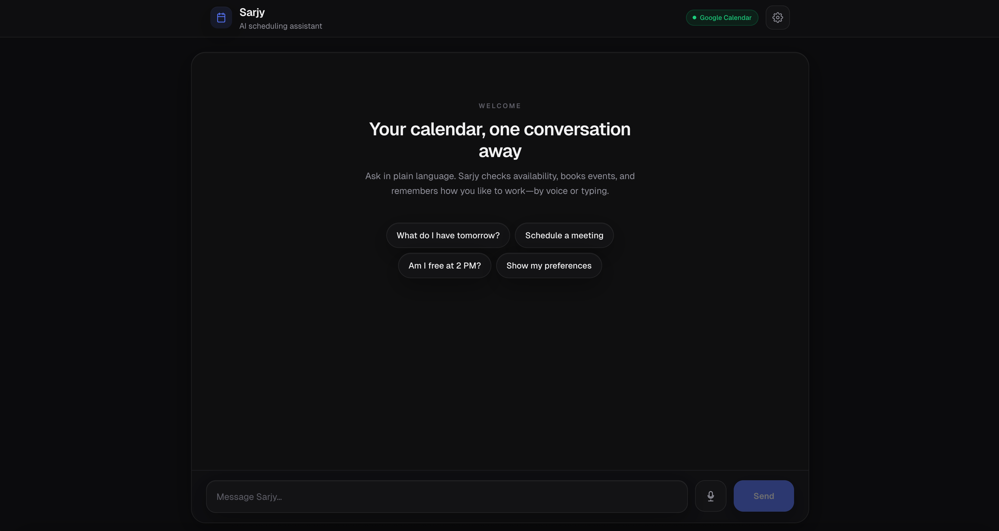
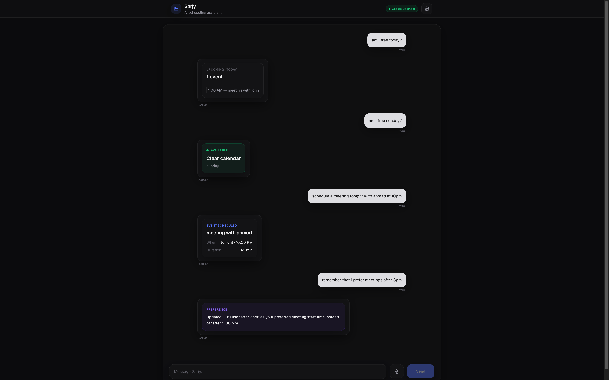

# Sarjy

Voice-first assistant for **Google Calendar**: talk or type to create events, check availability, list or adjust what’s on your calendar, and store simple preferences. Built as a **Next.js** demo (internship / portfolio scope), not multi-tenant production software.

## Stack

| Layer | Technology |
|--------|------------|
| UI | Next.js 16 (App Router), React 19, Tailwind 4, Framer Motion |
| Voice | Web Speech API (recognition + synthesis) |
| AI | OpenAI (`gpt-4.1-mini` by default) for intents, slot fill, general replies |
| Calendar | Google Calendar API (`googleapis`) |
| Persistence | Supabase (preferences + conversation log) |

## What it does

- **Voice or text** input; **read-aloud** for replies is **on by default** (toggle in Settings; preference is saved per browser).
- **Intents** (regex heuristics + OpenAI JSON): create / update / delete events, list events, check availability (with overlap detection), save or list preferences, general chat.
- **Slot filling** for create: title, date, time, duration; uses saved preferences for default duration and suggested meeting time when missing.
- **Conflict handling**: warns when a slot is busy; user can confirm **schedule anyway** (skips re-check after confirm).
- **Structured chat bubbles** via `parseAssistantContent` for common reply shapes (event created, lists, availability, etc.).

## Requirements

- Node 20+
- Google Cloud project with Calendar API enabled, OAuth client (web), and a refresh token with calendar scope.
- Supabase project with tables matching `src/lib/memory.ts` (see below).
- OpenAI API key.

## Local setup

```bash
cd sarjy
npm install
# Add .env.local — see table below
npm run dev
```

Open [http://localhost:3000](http://localhost:3000). Mic needs a **secure context** (localhost or HTTPS).

## Deploy on Vercel & voice on other devices

- Use the **`https://` production URL** only. Mic and speech APIs require a [secure context](https://developer.mozilla.org/en-US/docs/Web/Security/Secure_Contexts); plain `http://` will disable the mic.
- **Speech recognition** (mic button) is only available in browsers that expose `SpeechRecognition` / `webkitSpeechRecognition` — reliably **Chrome**, **Edge**, and **Samsung Internet** on Android. **Firefox** and **Safari** (including **iPhone**) usually **do not** support it; users should **type** or open the site in Chrome where possible.
- **Text-to-speech** (read replies aloud) is wider support but **iOS Safari** can stay silent when speech runs right after an async API response. The app calls `speechSynthesis.resume()` and defers playback slightly on iOS; if it still fails, **tap Send once** (user gesture) then try again, or use Settings to confirm **Read replies aloud** is on.
- Each device/browser has its own **microphone permission** and **localStorage** (voice toggle). A new phone will ask for mic again and uses default read-aloud **on** unless the user previously turned it off on that browser.

## Environment variables

Create `.env.local` (never commit secrets):

| Variable | Required | Purpose |
|----------|----------|---------|
| `OPENAI_API_KEY` | Yes* | Intents, fallbacks, general chat |
| `OPENAI_MODEL` | No | Default `gpt-4.1-mini` |
| `NEXT_PUBLIC_SUPABASE_URL` | Yes* | Supabase project URL |
| `SUPABASE_SECRET_KEY` | Yes* | Server-side Supabase (service role / secret) |
| `GOOGLE_CLIENT_ID` | Yes* | OAuth |
| `GOOGLE_CLIENT_SECRET` | Yes* | OAuth |
| `GOOGLE_REDIRECT_URI` | Yes* | Must match Google Console (e.g. `http://localhost:3000/api/auth/google/callback`) |
| `GOOGLE_REFRESH_TOKEN` | Yes* | Long-lived access to one calendar account |
| `GOOGLE_CALENDAR_ID` | No | Default `primary` |
| `TIMEZONE` | No | IANA tz for event write/update (default `Asia/Riyadh`) |
| `TZ_OFFSET` | No | Fixed offset for day-bounding when listing (default `+03:00`) |

\*Without OpenAI, some flows degrade to heuristics or static fallbacks. Without Google token, calendar calls fail. Without Supabase, preference/history writes error (errors are mostly swallowed in chat logging).

### Google OAuth (this repo’s flow)

1. Set `GOOGLE_REDIRECT_URI` to your callback URL and add it in Google Cloud Console.
2. Visit `/api/auth/google` to start OAuth.
3. After redirect, the **callback** logs tokens to the **server console**. Copy `refresh_token` into `GOOGLE_REFRESH_TOKEN` and restart the dev server.

### Supabase schema (minimal)

- **`preferences`**: `user_id` (text), `key` (text), `value` (text), `updated_at` (timestamptz). Unique on `(user_id, key)` for upserts.
- **`conversation_history`**: `user_id` (text), `role` (`user` \| `assistant`), `content` (text), `created_at` optional.

The chat API currently uses a fixed `demo-user` id (single-account demo).

## Scripts

```bash
npm run dev      # development
npm run build    # production build
npm run start    # run production server
npm run lint     # ESLint
```

## Project layout (high level)

```
src/app/
  page.tsx                 # Chat UI, voice hooks
  api/chat/route.ts        # Orchestration: intents, calendar, prefs, pending drafts
  api/calendar/*           # create, list, update/delete helpers + HTTP where exposed
  api/auth/google/*        # OAuth start + callback
src/lib/
  intentParser.ts          # Heuristics + OpenAI classification
  memory.ts                # Supabase preferences + message log
  googleCalendar.ts        # OAuth client + authenticated Calendar client
  parseAssistantContent.ts # Assistant text → UI blocks
src/components/sarjy/      # Header, composer, messages, settings, empty state
src/hooks/                 # useSpeechRecognition, useSpeechSynthesis
```

## Limitations (by design)

- **One calendar account** per deployment (env refresh token), not per-browser user login.
- **Conversation context** in the model is mostly the **recent messages** the client sends; DB history is **written** for logging, not fully replayed into every turn.
- **`check_conflict`** intent is a light stub; real overlap UX is **`check_availability`** and create-time conflict prompts.
- **Reminders** are not implemented as Google Reminders—placeholder copy only.

## UI

**Main page:**


**Chat example:**


## License

Private / project use unless you add a license.
